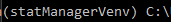

# statManager status

## Working functionality 

- ```processStats```: [How to run processStats](#how-to-run-processstats)
    - Takes in a "Data Log" file
    - Outputs the following CSV files that contain various processed statistics 
        - ```playerTotals.csv```
            - Contains each players total kills, deaths, damange, objective stat, and K/D ratio
        - ```playerGamemodeTotals.csv```
            - Contains each players total kills, deaths, damange, objective stat, and K/D ratio for each gamemode
        - ```playerMapTotals.csv```
            - Contains each players total kills, deaths, damange, objective stat, and K/D ratio for each map
        - ```playerMapGamemodeTotals.csv```
            - Contains each players total kills, deaths, damange, objective stat, and K/D ratio for each map's gamemode 
        - ```playerAvgs.csv```
            - Contains each players average kills, deaths, damange, and objective stat
        - ```playerGamemodeAvgs.csv```
            - Contains each players average kills, deaths, damange, and objective stat
        - ```playerMapAvgs.csv```
            - Contains each players average kills, deaths, damange, and objective stat
        - ```playerMapGamemodeAvgs.csv```
            - Contains each players average kills, deaths, damange, and objective stat
    - *NOTE: Objective stats are based on the gamemode (Hardpoint - hill time, SND - first bloods, Control - ticks)*

## Functionality coming soon 

- Stat webscraping

# How To's

## How to run processStats

### First time setup

**NOTE: This assumes you have Python installed on your computer**

1. Clone this repository.
    - In the terminal (Windows - use CMD, Mac - use Bash), within a folder of your choice, type the command: ```git clone https://github.com/CODAgent/esports-agent-tools.git```
2. In the terminal, navigate to the ```esports-agent-tools/codagent/statManager``` folder.
    - On windows, type the following command: ```cd esports-agent-tools\codagent\statManager```
    - On mac, type the following command: ```cd esports-agent-tools/codagent/statManager```
3. Setup a virtual environment.
    - Type the following command: ```python -m venv ./statManagerVenv```
4. Activate the virtual environment.
    - On windows, type the following comamand: ```statManagerVenv\Scripts\activate```
    - On mac, type the following comamand: ```source statManagerVenv/bin/activate```
    - **NOTE: You should now see this in parentheses in your terminal:**
        - 
5. Install the requirements. 
    - Type the following command: ```pip install -r requirements.txt```

### Running processStats

1. Download the "Data Log" file as a CSV file from our Google Drive.
    - Open the "Data Log" file in Google Sheets
    - Click "File"
    - Mouseover "Download"
    - Click "Comma Separated Values (.csv)"
    - *NOTE: This will save the "Data Log" CSV file to your computer's ```Downloads``` folder*
2. Activate the virtual environment.
    - Open your terminal (Windows - use CMD, Mac - use Bash)
    - Navigate to ```esports-agent-tools/codagent/statManager``` in your terminal using ```cd```
    - On windows, type the following comamand: ```statManagerVenv\Scripts\activate```
    - On mac, type the following comamand: ```source statManagerVenv/bin/activate```
    - **NOTE: You should now see this in parentheses in your terminal:**
        - 
3. Run main.
    - In your terminal, type the following command: ```python main.py```
    - Once the file explorer pops-up, select the "Data Log" CSV file you downloaded 
    - Once you select this file, the processStats script will run and the outputted CSV files can be found within the ```outputFiles``` folder 